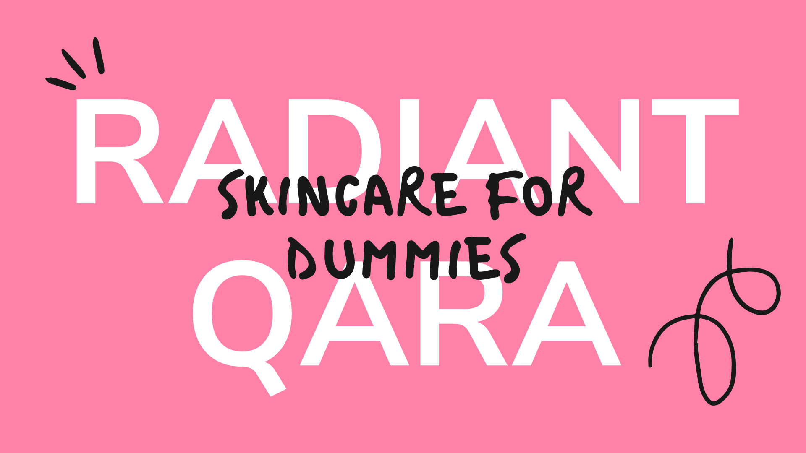

# Final Project

This week's project is the final project.

## What is this? 🧐

Radiant Qara is an API where you can find everything from a personalized skincare routine, based on your skin type and budget to lots and lots of information aboutdifferent products.

# Why? 🙆🏽‍♀️

Radiant Qara is made for all those new people that want to get into the world of skincare in just a few clicks.
With Radiant Qara you will achieve aroutine with perfect products that fit you.

Also, Radiant Qara is a mix of two things that I enjoy very much and from which I havelearned a lot lately: Data analytics and skincare products.

# What did I did? 📝

In this repo you will seven folders and a main file called my_api.

1. Data:

Here it is all the data used in this project, from the original dataset to the final dataset used for the contest.

2. Config:

To initialize the database in MongoDB

3. Images:

All the images used in this project.

4. Notebook:

Here you will find all the notebooks that contains the process of this project. 
From the cleaning of the data, to enrich the original dataset and also, some tests.

5. Output:

The final presentation of this project.

6. Src:

Files with functions used in this project.

7. Tools:

Files with functions used for the API.

8. My_api:

This file contains all the structure of the API.

## Resources 🛠

- Pandas ([documentation](https://pandas.pydata.org/docs/))

- Beautiful Soup ([documentation](https://www.crummy.com/software/BeautifulSoup/bs4/doc/))

- MongoDB ([documentation](https://docs.mongodb.com/))

- Streamlit ([documentation](https://docs.streamlit.io/en/stable/))

## As always 💁🏽‍♀️

Feel free to tell me anything you think will help me or my code be better analyts.